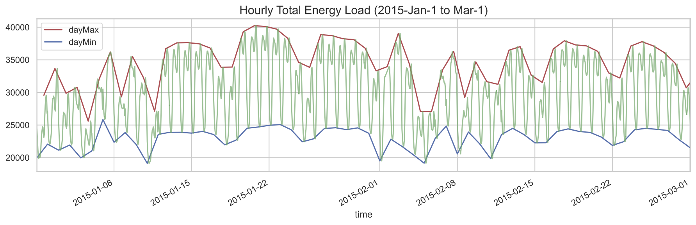
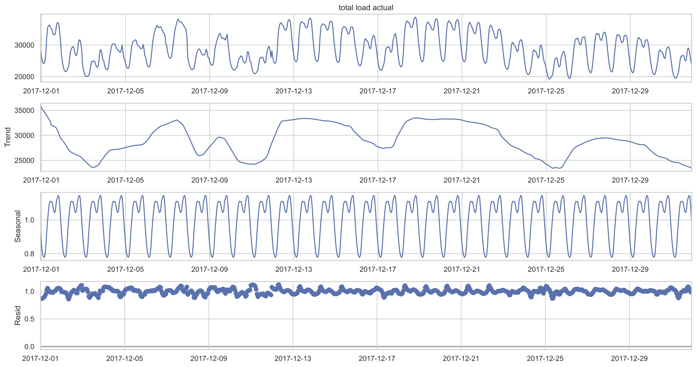
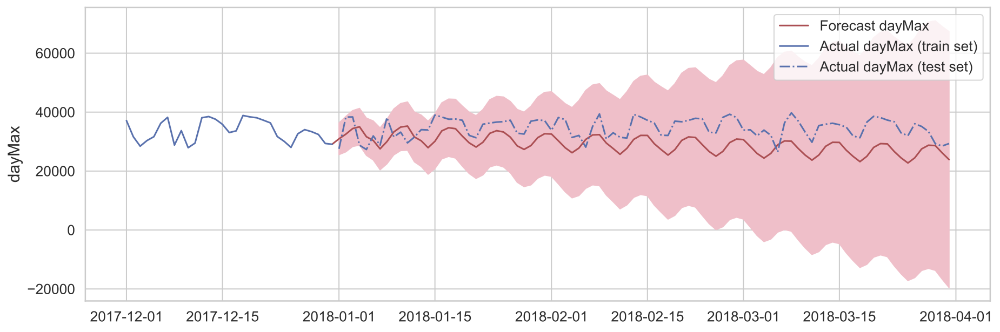
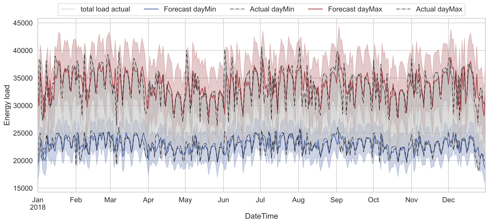

# Capstone - **Energy Demand Prediction**

Energy suppliers/companies need to ensure the electricity supply always meets their customers’ demands (reliability of supply) and prevents the supply shortage. As the energy consumptions depend on the time, the day, seasons, and even weather, etc. Companies must estimate/forecast how much electricity to generate, buy from, the price to sell in advance, and whether to invest in various electrical infrastructure.

This project aims to build a time series forecasting model that can predict the electrical consumption of the next day, given the information about the past electricity loads. Here, we focus on the four years of data in Spain. The final goal is to have a model forecasting the range (minimal and maximum) of electricity load from day to day.

## Documentation

1. **Notebooks**

   [**Data wrangling**](https://nbviewer.jupyter.org/github/mendyhsu/Capstone/blob/master/a_data_wrangling.ipynb)

   [**EDA**](b_EDA.ipynb)

   [**SARIMAX Modeling**](d_TimeSeriesModeling.ipynb)

   

2.  [**Summary Report**](Report/Capstone_Report_ Energy_Load_Forecast.pdf)  and   [**Slides**](Report/Capstone_Slides_%20Energy_Load_Forecast.pdf)

## **1. Dataset**

 [**Hourly energy demand generation and weather**](https://www.kaggle.com/nicholasjhana/energy-consumption-generation-prices-and-weather): **energy_dataset.csv**, and **weather_features.csv** (**24.98 MB**) contain **four years** of electrical consumption, generation, pricing, and weather data for Spain. 

Figure 1: Hourly total load over the 3 months (green line). The red (blue) line shows the maximum (minimum) load in a day.

## 2. Data Cleaning and Wrangling

* `total load actual`: forward filling in NaN with linear interpolation.

* `dayMax`, `dayMin`: extract the daily maximal (red line) and minimum (blue) total loads (Fig. 1).

## 3. Problem Formulation

### 3.1 Objectives

1. Predicting daily **minimum** and **maximum** *total load* using the **Seasonal ARIMA (this is our focus).**
2. Extract the pattern of **hourly total loads** for a typical day using **Time Series Decomposition**.

### 3.2 Training Data Development

1. Split Train-test Sets - We split the data into a **training (~75%)** and a **test (~25%)** set, and pick the best model based on the one with minimal AIC score.
   * **Train** (~75%): 2015-1-1 to 2017-12-31
   * **Test** (~25%): 2018-1-1 to 2018-12-31
   * **Evaluation score**: Akaike Information Criterion (AIC).

 

2. Potential Improvement – Applying the **rolling cross validation** on training set help find model parameters that are generalized to unseen data and avoid overfitting. This can be achieved via `pmdarima` API:

   `Pmdarima.model_selection.RollingForecastCV(...)`

## 4. Modeling - Seasonal ARIMA (SARIMAX)

### 4.1 SARIMAX Hyperparameters

1. SARIMAX stands for
   * ARIMA - **A**uto-**R**egressive **I**ntegrated **M**oving **A**verage
   * X – e**X**ogenous factors

 

2. Hyperparameters: **non-seasonal orders (p, d, q)** and **seasonal orders (P, D, Q, s)**
   * P, p – autoregressive
   * D, d – differencing order. Differencing the signal D times with seasonal steps (s); d times in normal step of 1.
   * Q, q – moving average
   * s – number of steps for a season 

 

### 4.2 Hyperparameter searching using Auto-ARIMA

1. Model evaluation score, **Akaike Information Criterion (AIC)**: 

   18887 for **dayMax**; 20430 for **dayMax**.

2. Best seasonal ARIMA parameters: 

   (p, d, q) = (5, 1, 0) and (P, D, Q, s) = (5, 1, 0, 7) for both the **dayMin** and **dayMax**.

## 5. Results

###5.1 Seasonal Decomposition ($y_t=T_t\times S_t\times R_t$)

We used seasonal decomposition to find the **repeatedly pattern within a day** (the third panel, seasonal trend).

### 5.2 Forecasting using the SARIMAX 

We will first show the long-term forecasted **dayMax** when we do not update the trained model with the new observations. Then, we show the predictions when we updated the trained model with the new points up to the day before forecasted.

#### 5.2.1 Forecasting (without updating the new point)

The predicted result sits around the actual **dayMax** for **about two weeks** and starts to deviate from actual one. Yet, the prediction still **captures the weekly oscillation** in long-term. 

#### 5.2.2 Forecasting (daily updating the new point)

If we updated the new observation a day before forecast, the predicted result goes around the actual **dayMax** and **dayMin**. However, the prediction cannot predict the **spike at the beginning of each month**.

Figure 2: The day-by-day forecast **dayMax** (red line) and **dayMin** (blue line). The shaded area are the confidence intervals. The gray line is the hourly load time series (same as green line in Fig. 1).

#### 5.2.3 Model Evaluation on Testset

| Tests                                                | **dayMin**      | **dayMax**      |
| ---------------------------------------------------- | --------------- | --------------- |
| **R-square (test set)**                              | 0.22            | 0.310           |
| **MSE (test set)**                                   | 1884188         | 7084441         |
| **MAE (test set)**                                   | 985.7           | 1987.4          |
| **MAPE (test set)**                                  | 1.997           | 2.547           |
| **Correlation (test set, prediction)** ; **p-value** | 0.547;  < 0.001 | 0.577;  < 0.001 |

## 5. Conclusion

1. **Seasonal ARIMAX** model for forecasting daily **min**/**max** energy load.

2. Auto ARIMA for hyperparameter tunning. 

   The best set of order parameters are **(p, d, q) = (5, 1, 0)**, and **(P, D, Q, s) = (5, 1, 0, 7)**. 

3. Model Evaluation: **MAPE (test set)** = 2 (dayMin) and 2.55 (dayMax).

   **Residual analysis** on the test set shows the current model did not capture some auto-correlation components (3 peaks from the autocorrelation plots). This uncaptured feature could be related to the **higher peak load** happening at the beginning of each month (Fig. 2).

## 6. Future Work

1. Combining the predicted daily Min/Max and hourly load pattern of a day (decomposition).
2. Other models for time series forecasting:  **LSTM** (Long-Short Term Memory); **NNETAR** (Neural NETwork AutoRegression).

 

